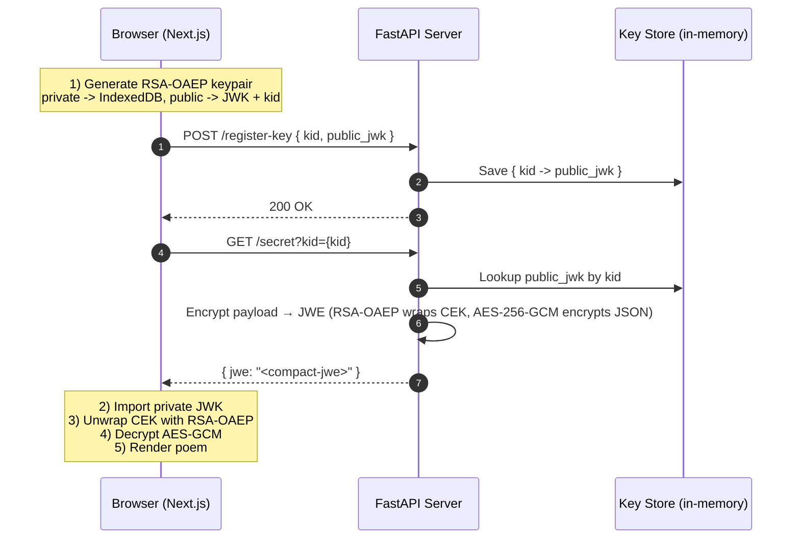

# FastAPI ↔ Next.js — JWE demo (client-side decryption)

A tiny project that sends **encrypted API responses** (JWE) from FastAPI and **decrypts only in the browser** (Next.js).  
You’ll see a romantic poem rendered in the UI; everyone else (CDNs, logs, network tab) just sees an opaque JWE blob.

---

## Why this exists

- Keep plaintext **out of your infra and intermediaries**.
- Browser holds the **private key**; server holds only the **public key**.
- Protects against accidental logging, packet capture, and curious coworkers.
- Caveat (always true for web apps): the user’s browser **must** decrypt to render, so if the browser is compromised, plaintext can leak.

---

## How it works

1. Browser creates an **RSA-OAEP** keypair on first load.
2. It sends the **public JWK** + `kid` to the server (`/register-key`).
3. Server encrypts the payload with a random **AES-256-GCM** key (CEK), **wraps** that CEK using the client public key (**RSA-OAEP**), and ships a **compact JWE**.
4. Browser uses the **private key** to unwrap the CEK and decrypt locally.

---

## Visual flow (Mermaid)

### Sequence diagram



### Data flow diagram

```mermaid
flowchart LR
  subgraph Client
    A[Private Key (IndexedDB)]:::safe --> D[Decrypt JWE in JS]
    D --> E[Render Poem]
  end

  subgraph Server
    B[(Public JWK by kid)]:::safe --> C[Encrypt JSON → JWE]
  end

  C == compact JWE ==> D

  classDef safe fill:#0b5,stroke:#0,stroke-width:0,color:#fff
```

---

## Stack

- **Server:** FastAPI, `jwcrypto`
- **Client:** Next.js (App Router), `jose`, `idb-keyval`

---

## Folder structure

```
.
├─ server/
│  ├─ app.py
│  └─ requirements.txt
└─ client/
   ├─ app/
   │  ├─ layout.tsx
   │  └─ page.tsx
   ├─ lib/
   │  └─ crypto.ts
   ├─ package.json
   ├─ tsconfig.json
   └─ next-env.d.ts
```

---

## Quick start

### Server

```bash
cd server
python -m venv .venv && source .venv/bin/activate
pip install -r requirements.txt
uvicorn app:app --reload --port 8000
```

### Client

```bash
cd client
npm install
npm run dev
# open http://localhost:3000
```

You should see only the poem in the UI.  
The `/secret` response body is a compact JWE string (check DevTools → Network).

---

## API

### `POST /register-key`

Registers a client public key.

**Request:**

```json
{
  "kid": "uuid-v4",
  "public_jwk": {
    "kty": "RSA",
    "n": "...",
    "e": "AQAB",
    "alg": "RSA-OAEP",
    "use": "enc",
    "key_ops": ["wrapKey", "encrypt"],
    "kid": "uuid-v4"
  }
}
```

**Response:**

```json
{ "ok": true }
```

---

### `GET /secret?kid=...`

Returns a compact JWE string containing the poem JSON.

**Response:**

```json
{ "jwe": "eyJ...five.parts..." }
```

**Decrypted JSON shape:**

```json
{
  "title": "A Quiet Conspiracy of Stars",
  "author": "Anonymous",
  "issued_at": 1710000000,
  "poem": "I love you in the unshowy ways:\n..."
}
```

---

## Crypto choices

- **Key wrapping:** RSA-OAEP (SHA-256)
- **Content encryption:** AES-256-GCM
- **Headers:** JWE protected header includes `alg`, `enc`, `kid`, `typ: JWE`
- **JWK key_ops:** public → `wrapKey`, `encrypt`; private → `unwrapKey`, `decrypt`

---

## Security notes

- Store the private key in IndexedDB.
- Mark sensitive endpoints: `Cache-Control: no-store`.
- Avoid logging bodies on the server — only metadata.
- Harden the client:
  - Decrypt in a Web Worker.
  - Add a strict CSP (no inline, no eval).
  - Optionally wrap the private key with a passphrase or protect it with WebAuthn.

---

## Troubleshooting

**InvalidJWKOperation:**

```text
"Encrypt key". Valid for: "['Encrypt content']"
```

Fix:

```ts
(pubJwk as any).key_ops = ["wrapKey", "encrypt"];
(privJwk as any).key_ops = ["unwrapKey", "decrypt"];
```

Then clear IndexedDB or bump your IDB keys.

**CORS errors:**  
Edit `allow_origins` in `server/app.py`.

**Old keys:**

```js
indexedDB.deleteDatabase("keyval-store");
```

**Blank UI despite valid network response:**

- Check server is running on `:8000`.
- Avoid mixed content (HTTPS client, HTTP server).

---

## Key rotation

1. Generate a new keypair client-side → new `kid`.
2. POST `/register-key` with the new public JWK.
3. Server starts using the new `kid`.
4. Keep old private key for in-flight messages.
5. Delete old `kid` after a grace period.

---

## Upgrading to HPKE (optional)

- Use **X25519 (ECDH)** + **ChaCha20-Poly1305 (HPKE)**.
- Works with `jose` and modern libs.
- Server: switch to ECDH-ES or HPKE.
- Client: import EC private JWK.
- Flow stays the same.

---

## License

MIT — adapt as you like.

---

💡 Possible enhancements:

- Web Worker decrypt path (keeps plaintext out of React state).
- CSP snippet to block inline/eval scripts.
